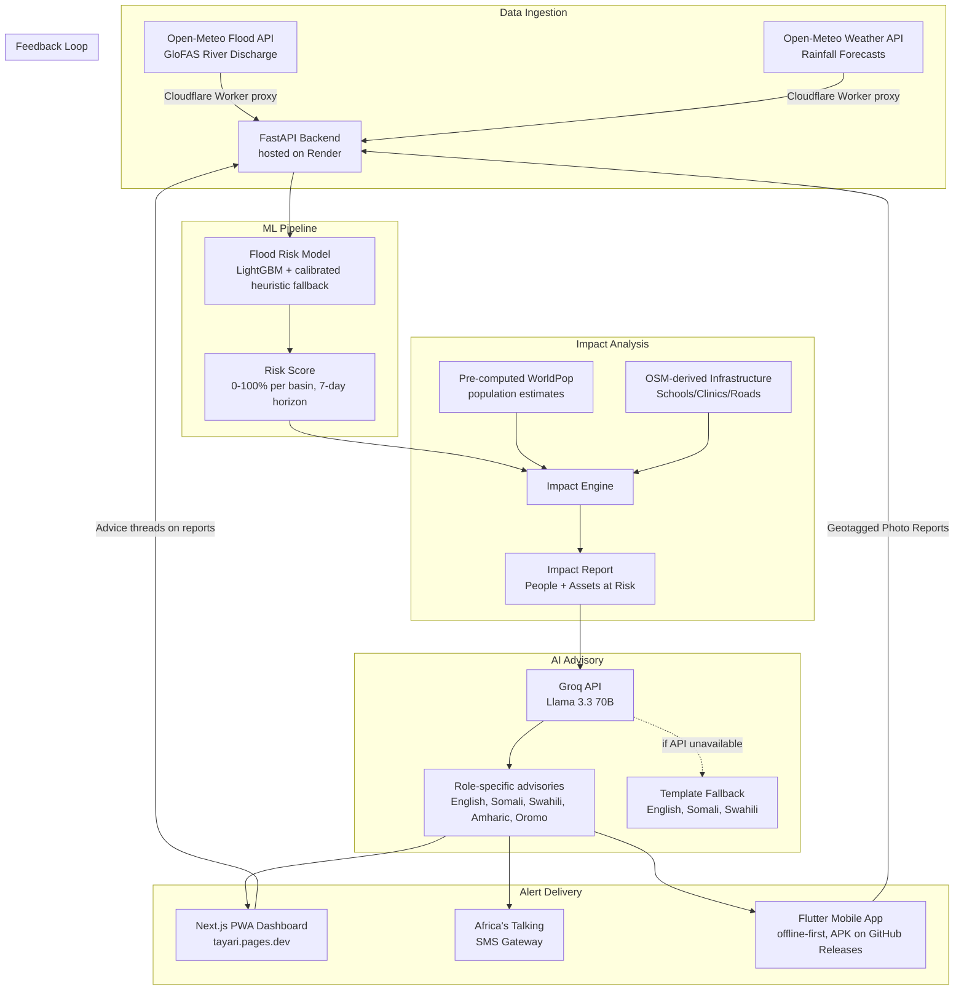

<div align="center">
  <h1>🌊 Tayari</h1>
  <p><b>AI Flood Early Warning & Early Action System</b></p>
  <p><i>Built for the IGAD Hackathon 2026</i></p>
  <p>
    <a href="https://tayari.pages.dev"><b>🌐 Use it now — free at tayari.pages.dev</b></a>
    ·
    <a href="https://github.com/Raul909/Tayari/releases"><b>📱 Download the Android app</b></a>
  </p>
</div>

---

## 💛 The Cause

In November 2023, floods on the Shabelle River displaced **half a million people** around Beledweyne. In South Sudan, floods between 2020 and 2022 affected **over a million**. In April–May 2024, the Tana River burst its banks in Kenya. In almost every case, the forecast data existed — global models like GloFAS saw the water coming days in advance.

The data existed. The warning never arrived.

Highly technical meteorological data stays trapped in dashboards, in English, written for scientists. The family on the riverbank, the teacher deciding whether to close the school, the clinic worker moving medicine to higher ground — they never see it, or can't act on it.

**Tayari** (Swahili for *Ready*) exists to close that gap between **information generated** and **information acted upon**. It doesn't just predict floods — it translates forecasts into plain-language, role-specific advisories in the languages people actually speak, and delivers them to the phones people actually carry.

Tayari is **free to use** and open source, because an early warning should never be behind a paywall:

- 🌐 **Web dashboard:** [tayari.pages.dev](https://tayari.pages.dev) — no signup, no cost
- 📱 **Android app:** [GitHub Releases](https://github.com/Raul909/Tayari/releases) — offline-first, built for low-bandwidth areas

## ✨ What it does

- 🔮 **Predicts** river flooding 1–7 days ahead using a LightGBM model (with a calibrated heuristic fallback) on Open-Meteo's GloFAS river discharge and rainfall forecasts.
- 🌍 **Overlays** impact data, estimating the population and critical infrastructure (schools, clinics, roads) at risk in each basin.
- 🗣️ **Translates** technical jargon into role-specific advisories in **English, Somali, Swahili, Amharic, and Oromo** using an LLM — with pre-written template fallbacks so warnings go out even if the AI is down.
- 📱 **Delivers** alerts via the Africa's Talking SMS gateway, a fast Next.js PWA dashboard for coordinators, and a Flutter mobile app for the field.
- 📸 **Listens** — community members submit geotagged photo reports of ground conditions, and coordinators or neighbours respond with advice threads (safe routes, closed bridges, who to contact) that everyone can see, closing the loop between forecast and reality.

---

## 🏗️ Architecture Under the Hood

Tayari is built on a decoupled, service-oriented architecture:



A small **Cloudflare Worker** does double duty: it proxies Open-Meteo requests (avoiding upstream rate limits) and pings the Render backend on a cron schedule so free-tier cold starts never delay a warning.

## 📍 Target Basins

Tayari monitors **eight** high-risk river basins across the IGAD region — chosen because each has a documented history of destructive flooding and vulnerable riverside communities:

| Basin | River | Country | Gauge (Town) | Historical Context |
|-------|-------|---------|--------------|--------------------|
| **Shabelle** | Shabelle River | Somalia | 4.74°N, 45.20°E *(Beledweyne)* | Nov 2023 — 500K displaced |
| **Juba** | Juba River | Somalia | 3.80°N, 42.54°E *(Luuq)* | Deyr/Gu seasonal floods |
| **Tana** | Tana River | Kenya | 2.27°S, 40.12°E *(Garsen)* | Apr–May 2024 |
| **Nzoia** | Nzoia River | Kenya | 0.10°N, 34.05°E *(Budalangi)* | Near-annual Lake Victoria basin floods |
| **Awash** | Awash River | Ethiopia | 11.73°N, 41.08°E *(Dubti)* | Afar floods 2020, 2023, 2024 |
| **White Nile** | White Nile | South Sudan | 6.21°N, 31.56°E *(Bor)* | 2020–2022 — 1M+ affected |
| **Blue Nile** | Blue Nile | Sudan | 15.55°N, 32.53°E *(Khartoum)* | Record 2020 floods — ~875K affected |
| **Omo** | Omo River | Ethiopia | 4.80°N, 35.96°E *(Omorate)* | South Omo floods 2019, 2023 |

*Adding a basin is a pure data change (`backend/app/data/basins.json`) — gauge/upstream points, discharge thresholds, impact figures and local infrastructure — so the coverage grid extends to new rivers without touching the model or UI.*

*Note: While the current implementation focuses solely on floods to ensure depth and quality, the architecture is designed to be easily extensible for other regional hazards like drought and locust swarms.*

---

## 🚀 Getting Started

The easiest way to try Tayari is the live dashboard at **[tayari.pages.dev](https://tayari.pages.dev)** — it's free and requires no setup.

If you want to spin it up locally, you'll need a couple of API keys. Don't worry — Open-Meteo is completely free and requires no auth!

### Prerequisites
- **Groq API Key**: Used to generate the AI advisories (free at [console.groq.com](https://console.groq.com)). Without one, Tayari falls back to built-in advisory templates.
- **Africa's Talking API Key**: Used for SMS delivery (a free sandbox account works perfectly).

### Running the Backend (FastAPI)
```bash
cd backend
python -m venv venv
source venv/bin/activate
pip install -r requirements.txt

# Set up your .env file
cp .env.example .env
# Edit .env with your API keys

uvicorn app.main:app --reload --port 8000
```
*Note: The backend includes basic security headers and rate-limiting (`slowapi`) out of the box to mitigate XSS and brute-force attacks.*

### Running the Frontend (Next.js)
```bash
cd frontend
npm install
npm run dev
```
Head over to `http://localhost:3000` and you should see the MapLibre dashboard lighting up with live basin data!

### Running the Mobile App (Flutter)
The native mobile app is optimized for low-bandwidth environments in the IGAD region, featuring offline maps, aggressive photo compression, and local caching of multilingual advisories. Prefer not to build it yourself? Grab the APK from [GitHub Releases](https://github.com/Raul909/Tayari/releases).
```bash
cd tayari_mobile
flutter pub get
flutter run
```
*Note: Photos are captured through the system camera app (no camera permission needed); the app asks for GPS permission to geotag community flood reports. Reports made while offline will be queued and synced automatically once a connection is restored.*

---

## 🛠️ Tech Stack

I chose tools that are fast, reliable, and perfectly suited for a machine-learning-driven web app:

- **Backend:** FastAPI (Python) — *Blazing fast, async-first, and natively speaks ML.*
- **Frontend (Web):** Next.js 14 (App Router) & Vanilla CSS — *SSR for performance, PWA ready, and a custom glassmorphism design system.*
- **Frontend (Mobile):** Flutter & Riverpod — *Native ARM performance, rendering vector maps instantly.*
- **Databases:** Isar Database — *Ultra-fast offline-first NoSQL caching for the mobile app.*
- **ML Model:** LightGBM — *Fast training on tabular data without needing a GPU, backed by a calibrated heuristic so predictions never go dark.*
- **Maps & Viz:** MapLibre GL JS, flutter_maplibre_gl & fl_chart — *Beautiful, interactive, and open-source.*
- **AI & Comms:** Groq API (Llama 3.3 70B) & Africa's Talking — *Best-in-class multilingual text generation and reliable East African SMS delivery.*
- **Hosting:** Cloudflare Pages (web, free at [tayari.pages.dev](https://tayari.pages.dev)), Render (API), and a Cloudflare Worker for proxying + keep-alive.

---

## 🎯 The Hindcast Demo (Nov 2023)

One of the coolest features to check out is the historical hindcast. If you query the historical data for the Shabelle basin around October-November 2023, you can watch the model predict the devastating Beledweyne floods days before they happened. It's a powerful validation of the system's potential to save lives.

---

## 🗺️ Roadmap — making lives easier, one feature at a time

Ideas we're actively thinking about, roughly in order of how many people they'd help:

| Feature | Why it matters |
|---------|----------------|
| **Two-way SMS & USSD** | Most at-risk households have basic phones, not smartphones. Subscribing to alerts and reporting conditions by texting a shortcode would reach the last mile. |
| **Voice advisories (IVR)** | Text excludes people who can't read. A phone call that reads the advisory aloud in Somali or Oromo serves elders and non-literate residents. |
| **Push notifications** | Free, instant risk-level-change alerts for the mobile app's home basin — no SMS costs for anyone. |
| **Safe-route guidance** | Don't just say "go to high ground" — show the route to the nearest assembly point, updated by community reports of closed roads and bridges. |
| **Satellite verification** | Cross-check community reports and forecasts against Sentinel-1 radar flood extent, so coordinators can separate rumor from reality. |
| **Anticipatory cash triggers** | Link HIGH-risk forecasts to humanitarian cash-transfer programs, so families can act *before* the water arrives, not after. |
| **Household registry** | Let community leaders register vulnerable households (elderly, disabled, pregnant) per basin so evacuations start with those who need the most time. |
| **Drought & locust modules** | The basin-config architecture already supports new hazards — same pipeline, different data feeds. |
| **Low-cost river gauges** | Solar LoRa water-level sensors at bridges would give ground truth between GloFAS grid points and sharpen the model. |
| **Printable sitreps** | One-click PDF situation reports for county officers to brief governors and share with responders who work offline. |

Have an idea that would help your community? [Open an issue](https://github.com/Raul909/Tayari/issues) — Tayari is built in the open.
