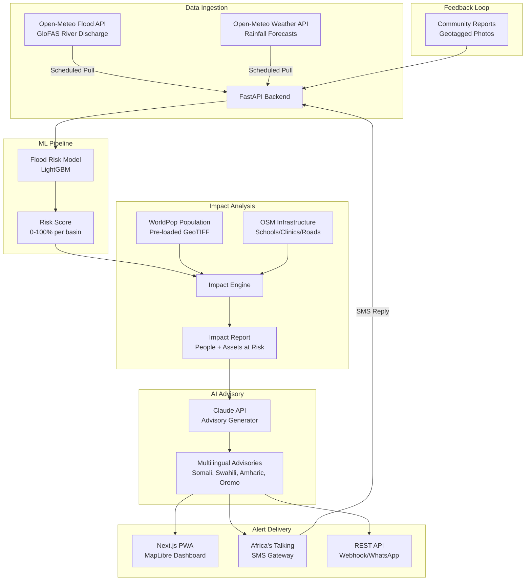

# Tayari — AI Flood Early Warning & Early Action System

**IGAD Hackathon 2026 Submission** | Deadline: July 31, 2026 5 PM EAT

An end-to-end flood early-warning system that **predicts** river flooding 1–7 days ahead, **translates** technical forecasts into multilingual plain-language advisories, **overlays** impact data (population, infrastructure), and **delivers** alerts via web + SMS — closing the gap between information generated and information acted upon.

---

## Architecture Overview



---

## User Review Required

> [!IMPORTANT]
> **API Keys Needed**: You'll need to provide:
> - **Anthropic API key** (for Claude advisory generation). A free-tier or hackathon-tier key works.
> - **Africa's Talking sandbox API key** (free — sign up at africastalking.com, use username `sandbox`).
> - No key needed for Open-Meteo (free, no auth).

> [!WARNING]
> **Scope Control**: The plan builds **one hazard (floods)** deeply across 3 basins. The architecture is pluggable for drought/locust, but we won't build those — we'll mention extensibility in the presentation. This is critical for finishing in 2.5 weeks.

---

## Open Questions

> [!IMPORTANT]
> 1. **Claude API vs Gemini API?** The brief mentions Claude, but if you prefer Gemini (free tier available), I can swap. The advisory-generation code is the same pattern either way.
> 2. **Deploy target**: Do you want me to include Docker Compose + Railway/Render deploy configs, or are you deploying manually?
> 3. **APK wrapping**: Do you want a TWA-wrapped APK for submission, or is the PWA sufficient?

---

## Proposed Changes

### Target Basins (3 high-risk IGAD river basins)

| Basin | River | Country | Lat/Lon (gauge point) | Historical Flood |
|-------|-------|---------|----------------------|-----------------|
| Shabelle | Shabelle River | Somalia | 4.74°N, 45.20°E (Beledweyne) | Nov 2023 — 500K displaced |
| Juba | Juba River | Somalia | 0.35°N, 42.54°E (Luuq) | Nov 2023 |
| Tana | Tana River | Kenya | -1.80°S, 40.02°E (Garsen) | Apr-May 2024 |

---

### Component 1: Project Foundation

#### [NEW] Root project structure

```
tayari/
├── backend/                  # FastAPI + ML pipeline
│   ├── app/
│   │   ├── __init__.py
│   │   ├── main.py           # FastAPI app entry + CORS
│   │   ├── config.py         # Settings (env vars, basin configs)
│   │   ├── models/
│   │   │   ├── __init__.py
│   │   │   └── schemas.py    # Pydantic models for API responses
│   │   ├── services/
│   │   │   ├── __init__.py
│   │   │   ├── flood_data.py     # Open-Meteo Flood API client
│   │   │   ├── weather_data.py   # Open-Meteo Weather API client
│   │   │   ├── flood_model.py    # LightGBM flood risk scoring
│   │   │   ├── impact.py         # Population/infrastructure impact
│   │   │   ├── advisory.py       # Claude/Gemini advisory generation
│   │   │   └── alerts.py         # SMS delivery via Africa's Talking
│   │   ├── routers/
│   │   │   ├── __init__.py
│   │   │   ├── forecasts.py      # GET /api/forecasts/{basin_id}
│   │   │   ├── alerts.py         # POST /api/alerts/send
│   │   │   ├── reports.py        # POST /api/reports (community feedback)
│   │   │   └── basins.py         # GET /api/basins
│   │   └── data/
│   │       ├── basins.json       # Basin definitions + thresholds
│   │       └── population/       # Pre-processed WorldPop extracts
│   ├── requirements.txt
│   ├── Dockerfile
│   └── .env.example
├── frontend/                  # Next.js 14 PWA
│   ├── src/
│   │   ├── app/
│   │   │   ├── layout.js
│   │   │   ├── page.js           # Dashboard home (map view)
│   │   │   ├── basin/[id]/
│   │   │   │   └── page.js       # Basin detail view
│   │   │   ├── alerts/
│   │   │   │   └── page.js       # Alert management
│   │   │   └── report/
│   │   │       └── page.js       # Community report submission
│   │   ├── components/
│   │   │   ├── FloodMap.js       # MapLibre GL map component
│   │   │   ├── RiskGauge.js      # Animated risk meter
│   │   │   ├── ForecastChart.js  # Discharge time series chart
│   │   │   ├── AdvisoryCard.js   # Multilingual advisory display
│   │   │   ├── ImpactPanel.js    # Population/infra at risk
│   │   │   ├── AlertDialog.js    # Send alert confirmation
│   │   │   ├── BasinSelector.js  # Basin navigation
│   │   │   └── Navbar.js
│   │   ├── lib/
│   │   │   ├── api.js            # Backend API client
│   │   │   └── constants.js      # Basin coords, colors, thresholds
│   │   └── styles/
│   │       └── globals.css
│   ├── public/
│   │   ├── manifest.json         # PWA manifest
│   │   ├── sw.js                 # Service worker for offline
│   │   └── icons/
│   ├── next.config.js
│   ├── package.json
│   └── Dockerfile
├── docker-compose.yml
├── README.md
└── .gitignore
```

---

### Component 2: Backend — Data Ingestion Layer

#### [NEW] flood_data.py

Pulls from the **Open-Meteo Flood API** (GloFAS v4, 5 km resolution). No API key needed.

- **Endpoint**: `https://flood-api.open-meteo.com/v1/flood`
- **Variables fetched**: `river_discharge`, `river_discharge_mean`, `river_discharge_max`, `river_discharge_min`, `river_discharge_median`
- **Forecast window**: 7 days (primary) + 92 days (extended outlook)
- **Past days**: up to 92 days for trend context
- For each basin, fetches discharge at the gauge-point coordinates defined in `basins.json`
- Returns structured `BasinForecast` Pydantic model

#### [NEW] weather_data.py

Pulls **upstream rainfall** from Open-Meteo Weather API (no key needed).

- **Endpoint**: `https://api.open-meteo.com/v1/forecast`
- **Variables**: `precipitation_sum`, `rain_sum` (daily)
- Fetches for the basin's upstream catchment center point
- Combined with discharge data to feed the flood model

---

### Component 3: Backend — ML Flood Risk Model

#### [NEW] flood_model.py

A **LightGBM gradient-boosted classifier** that predicts flood probability (0–100%) for each basin, 1–7 days ahead.

**Features engineered from the API data:**
| Feature | Source | Description |
|---------|--------|-------------|
| `discharge_current` | Open-Meteo Flood | Today's mean river discharge (m³/s) |
| `discharge_forecast_d1..d7` | Open-Meteo Flood | Forecasted discharge for days 1–7 |
| `discharge_anomaly` | Computed | Current discharge / historical median for this day-of-year |
| `discharge_trend` | Computed | 3-day moving average slope |
| `precip_upstream_cumulative_3d` | Open-Meteo Weather | 3-day cumulative upstream precipitation |
| `precip_upstream_cumulative_7d` | Open-Meteo Weather | 7-day cumulative upstream precipitation |
| `precip_forecast_d1..d3` | Open-Meteo Weather | Forecasted upstream rainfall |
| `month` | Calendar | Seasonal encoding |
| `is_ond_season` | Calendar | Binary: October-December (main flood season for East Africa) |

**Training strategy (hackathon-feasible):**
1. Use Open-Meteo's `past_days` + historical archive to pull ~2 years of discharge data for each basin
2. Label flood events using a simple threshold: discharge > 2× long-term median = flood day
3. Augment with known historical flood dates (Nov 2023 Beledweyne, etc.)
4. Train per-basin LightGBM models (fast to train, no GPU needed)
5. For demo: **hindcast the November 2023 Beledweyne flood** — show the model predicting flood probability rising 3–5 days before the actual event

**Output**: `FloodRiskScore` with:
- `probability`: 0.0–1.0 per day, days 1–7
- `risk_level`: "LOW" / "MODERATE" / "HIGH" / "EXTREME"
- `confidence_interval`: from ensemble spread in GloFAS data
- `threshold_exceedance_days`: estimated days until flood threshold crossed

---

### Component 4: Backend — Impact Analysis Engine

#### [NEW] impact.py

Converts "river high" into "N people, M schools, K clinics at risk" — impact-based forecasting.

**Data sources (pre-loaded, not runtime):**
- **WorldPop** population density GeoTIFF: extract and pre-process population counts within floodplain buffers (~5 km from river) for each basin. Store as simple JSON lookup keyed by risk level
- **OpenStreetMap** infrastructure: query Overpass API once during setup to extract schools, clinics, hospitals, and markets within each basin's flood zone. Cache as GeoJSON

**Implementation:**
- For each risk level (moderate/high/extreme), define concentric flood zones (2 km / 5 km / 10 km buffer from river)
- Pre-compute population + infrastructure counts per zone per basin
- At runtime: risk level → lookup → "~40,000 people, 6 schools, 2 clinics in projected flood zone"
- Returns `ImpactAssessment` Pydantic model

This is a pragmatic approach for a hackathon — we pre-compute impact data rather than doing real-time raster analysis, but the numbers are real and the architecture supports future real-time computation.

---

### Component 5: Backend — AI Advisory Generator

#### [NEW] advisory.py

Uses **Claude API** (or Gemini — swappable) to generate plain-language, role-specific, multilingual advisories.

**Flow:**
1. Receive `FloodRiskScore` + `ImpactAssessment`
2. Construct structured prompt with:
   - Basin name, river name, country
   - Risk probability and timeline
   - Population and infrastructure at risk
   - Target role (farmer / pastoralist / county officer / community leader)
   - Target language (Somali / Swahili / Amharic / Oromo / English)
3. Prompt template instructs the LLM to:
   - Use simple, actionable language
   - Include specific timelines ("by Thursday")
   - Tailor advice to role (farmer: "move grain to high ground"; officer: "pre-position evacuation boats")
   - Output in the target language
4. Cache advisories for 6 hours (same risk level = same advisory)

**Example output (Somali, farmer role):**
> "DIGNIIN: Webiga Shabeelle ayaa la filayaa inuu daado soo gaaro Beledweyne 3-5 maalmood gudahood. Heerka khatarta waa SARE. Tallaabo qaad: guurii xoolaha dhulka sare, kaydi hadhuudhka meel qallalan, hubso biyo nadiif ah."

---

### Component 6: Backend — Alert Delivery (SMS)

#### [NEW] alerts.py

Uses **Africa's Talking SDK** (sandbox mode) for SMS delivery.

```python
import africastalking
africastalking.initialize("sandbox", api_key)
sms = africastalking.SMS
sms.send(advisory_text, ["+2521234567"])
```

- Sandbox mode: simulates delivery, visible in AT dashboard. No real phone needed for demo
- For the demo video: show the AT dashboard receiving the SMS in real-time
- Also exposes a webhook endpoint for incoming SMS replies (community feedback)
- Architecture supports future WhatsApp Business API integration

---

### Component 7: Backend — API Routers

#### [NEW] routers/forecasts.py

| Endpoint | Method | Description |
|----------|--------|-------------|
| `/api/basins` | GET | List all monitored basins with current risk levels |
| `/api/forecasts/{basin_id}` | GET | Full forecast: discharge data, risk score, impact, advisory |
| `/api/forecasts/{basin_id}/history` | GET | Historical discharge + past flood events |
| `/api/alerts/send` | POST | Trigger SMS alert for a basin (with role + language) |
| `/api/alerts/history` | GET | List sent alerts |
| `/api/reports` | POST | Submit community geotagged report |
| `/api/reports` | GET | List community reports for a basin |
| `/api/advisory/{basin_id}` | GET | Get AI advisory (with `?role=farmer&lang=so` params) |

---

### Component 8: Frontend — Next.js PWA Dashboard

#### [NEW] Main Dashboard (page.js)

**Design system:**
- Dark theme with high-contrast risk colors (green → amber → red → deep red)
- Color palette: deep navy `#0A1628` background, electric blue `#3B82F6` accents, risk gradient `#22C55E → #EAB308 → #EF4444 → #991B1B`
- Typography: Inter (heading) + Roboto Mono (data)
- Glassmorphism panels over the map
- Micro-animations: risk gauge pulse, alert ripple effect

**Map view (MapLibre GL JS):**
- Full-screen map centered on the Horn of Africa
- OpenFreeMap basemap tiles (free, no API key)
- Basin markers with pulsing risk halos (color = risk level)
- Click a basin → fly-to animation → detail panel slides in
- River course overlay (GeoJSON from OpenStreetMap)
- Flood zone buffer visualization (concentric rings showing moderate/high/extreme zones)

#### [NEW] Basin Detail View (basin/[id]/page.js)

Three-panel layout:
1. **Risk Gauge** — animated circular gauge showing flood probability, with 7-day forecast sparkline
2. **Forecast Chart** — interactive line chart (Chart.js) showing river discharge vs. flood threshold, with ensemble uncertainty band
3. **Impact & Advisory Panel** — population/infrastructure counts + AI-generated advisory text with language selector

#### [NEW] Alert Management (alerts/page.js)

- Select basin, role (farmer/officer/community leader), language
- Preview advisory text
- Send button → triggers SMS via backend → shows confirmation with Africa's Talking response
- Alert history table

#### [NEW] Community Reports (report/page.js)

- Mobile-first form
- Photo upload with geolocation
- Simple status selector: "Water rising" / "Road flooded" / "All clear"
- Reports appear as pins on the main map
- This is the **feedback loop** — ground truth for model validation

#### [NEW] PWA Configuration

- `manifest.json` with app name "Tayari", theme color, icons
- Basic service worker for offline caching of map tiles + last-known forecasts
- Add-to-homescreen prompt

---

### Component 9: Hindcast Demo (Beledweyne Nov 2023)

This is the **killer demo moment** for the video.

#### [NEW] backend/app/services/hindcast.py

- Pull historical discharge data for Shabelle at Beledweyne for Oct–Nov 2023 using Open-Meteo's `start_date` and `end_date` parameters
- Run the trained model on this historical data day-by-day
- Generate a timeline showing: "Our model would have raised the risk to HIGH on Nov X, 3 days before the actual flood"
- Frontend renders this as an animated timeline replay

---

## Implementation Timeline (2.5 weeks)

| Week | Days | Focus | Deliverables |
|------|------|-------|-------------|
| **1** | Days 1–3 | Foundation | Project scaffold, API clients working, live discharge data on map |
| **1** | Days 4–5 | ML Model | Feature engineering, LightGBM trained on historical data, risk scores flowing |
| **2** | Days 6–7 | Impact + AI | WorldPop/OSM data pre-processed, Claude advisory generation working |
| **2** | Days 8–9 | Frontend polish | All 4 pages built, animations, responsive design |
| **2** | Day 10 | SMS + Feedback | Africa's Talking integration, community report form |
| **3** | Day 11 | Hindcast | Nov 2023 Beledweyne replay working |
| **3** | Day 12–13 | Integration test | End-to-end flow: data → model → advisory → SMS → map |
| **3** | Day 14 | Demo video | Record 5-minute demo |
| **3** | Day 15 | Polish + Submit | README, GitHub repo, Devpost submission |

---

## Verification Plan

### Automated Tests
```bash
# Backend
cd backend && pytest tests/ -v
# Test flood data fetching
python -m pytest tests/test_flood_data.py -v
# Test model predictions
python -m pytest tests/test_flood_model.py -v

# Frontend
cd frontend && npm run build  # Verify no build errors
```

### Manual Verification
1. **Data pipeline**: Visit `/api/forecasts/shabelle` and confirm live discharge data from Open-Meteo
2. **Map**: Open the PWA, confirm 3 basin markers visible with correct risk colors
3. **Advisory**: Click a HIGH-risk basin → confirm advisory generates in Somali/Swahili
4. **SMS**: Send a test alert → confirm it appears in Africa's Talking sandbox dashboard
5. **Hindcast**: Navigate to Beledweyne → play the Nov 2023 replay → confirm risk rises before the actual flood date
6. **PWA**: Test add-to-homescreen on Android Chrome
7. **Offline**: Kill network → confirm last-known forecast still displays

### Demo Video Checklist
- [ ] Show the map with live risk levels across 3 basins
- [ ] Click into Beledweyne, show the hindcast: "our model would have warned 3 days early"
- [ ] Generate a multilingual advisory → show it switching from English to Somali
- [ ] Send an SMS alert → show it arriving in Africa's Talking dashboard
- [ ] Submit a community report with a photo
- [ ] Show the report appearing on the map
- [ ] Mention the extensibility architecture (one more hazard could plug in)

---

## Tech Stack Summary

| Layer | Technology | Why |
|-------|-----------|-----|
| Backend | FastAPI (Python 3.11+) | Async, fast, great for ML integration |
| ML Model | LightGBM | Fast training, no GPU, handles tabular data well |
| Database | SQLite (dev) / PostgreSQL (prod) | Simple for hackathon, upgradeable |
| Frontend | Next.js 14 (App Router) | SSR, PWA support, React ecosystem |
| Map | MapLibre GL JS + OpenFreeMap | Free, no API key, vector tiles, offline-capable |
| Charts | Chart.js | Lightweight, responsive |
| AI Advisory | Claude API (Anthropic) | Strong multilingual generation |
| SMS | Africa's Talking (sandbox) | Standard in East Africa, free sandbox |
| Styling | Vanilla CSS + CSS variables | Full control, no framework lock-in |
