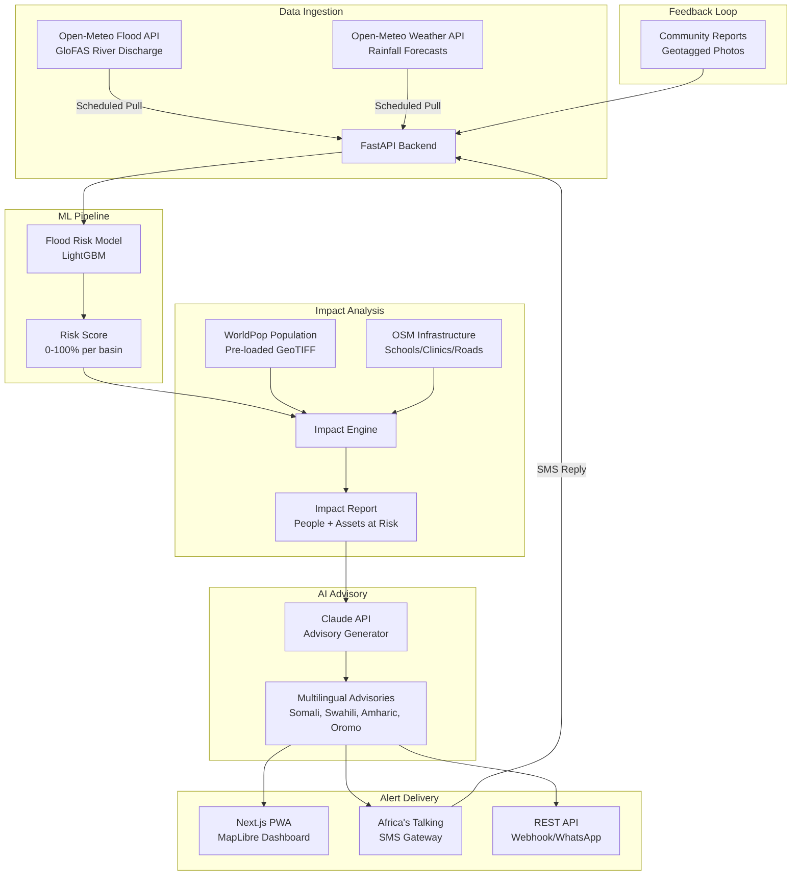

<div align="center">
  <h1>🌊 Tayari</h1>
  <p><b>AI Flood Early Warning & Early Action System</b></p>
  <p><i>Built for the IGAD Hackathon 2026</i></p>
</div>

---

**Tayari** (Swahili for *Ready*) is an end-to-end early warning system designed to give communities in the IGAD region a fighting chance against devastating floods. 

Too often, highly technical meteorological data stays trapped in dashboards. I built Tayari to close the gap between **information generated** and **information acted upon**. It doesn't just predict floods—it translates those forecasts into actionable, plain-language advisories in local languages and delivers them directly via SMS.

## ✨ What it does

- 🔮 **Predicts** river flooding 1–7 days ahead using a LightGBM model and Open-Meteo's GloFAS data.
- 🌍 **Overlays** impact data, automatically calculating the population and critical infrastructure (schools, clinics) within the projected flood zone.
- 🗣️ **Translates** technical jargon into role-specific, multilingual advisories (Somali, Swahili, Amharic, Oromo, English) using AI.
- 📱 **Delivers** alerts directly to mobile phones via the Africa's Talking SMS gateway, alongside a fast Next.js PWA dashboard for coordinators.

---

## 🏗️ Architecture Under the Hood

Tayari is built on a decoupled, service-oriented architecture:



## 📍 Target Basins

For this hackathon, I've focused deeply on three high-risk river basins in the IGAD region:

| Basin | River | Country | Gauge Coordinates | Historical Context |
|-------|-------|---------|----------------------|-----------------|
| **Shabelle** | Shabelle River | Somalia | 4.74°N, 45.20°E *(Beledweyne)* | Nov 2023 — 500K displaced |
| **Juba** | Juba River | Somalia | 3.80°N, 42.54°E *(Luuq)* | Nov 2023 |
| **Tana** | Tana River | Kenya | 2.27°S, 40.12°E *(Garsen)* | Apr-May 2024 |

*Note: While the current implementation focuses solely on floods to ensure depth and quality, the architecture is designed to be easily extensible for other regional hazards like drought and locust swarms.*

---

## 🚀 Getting Started

If you want to spin this up locally, you'll need a couple of API keys. Don't worry, Open-Meteo is completely free and requires no auth!

### Prerequisites
- **Anthropic API Key**: Used to generate the AI advisories.
- **Africa's Talking API Key**: Used for SMS delivery (a free sandbox account works perfectly).

### Running the Backend (FastAPI)
```bash
cd backend
python -m venv venv
source venv/bin/activate
pip install -r requirements.txt

# Set up your .env file
cp .env.example .env
# Edit .env with your API keys

uvicorn app.main:app --reload --port 8000
```
*Note: The backend includes basic security headers and rate-limiting (`slowapi`) out of the box to mitigate XSS and brute-force attacks.*

### Running the Frontend (Next.js)
```bash
cd frontend
npm install
npm run dev
```
Head over to `http://localhost:3000` and you should see the MapLibre dashboard lighting up with live basin data!

### Running the Mobile App (Flutter)
The native mobile app is optimized for low-bandwidth environments in the IGAD region, featuring offline-first caching (Isar), aggressive photo compression, and local caching of multilingual advisories. Map tiles stream from OpenFreeMap.
```bash
cd tayari_mobile
flutter pub get
flutter run
```
*Note: The mobile app requires Camera and GPS permissions to submit geotagged community flood reports. Reports are saved to a local queue and uploaded to the backend automatically once a connection is available. The Android emulator reaches the local backend at `10.0.2.2:8000`; for a physical device, point it at your machine with `--dart-define=API_BASE_URL=http://<your-ip>:8000/api`.*

---

## 🛠️ Tech Stack

I chose tools that are fast, reliable, and perfectly suited for a machine-learning-driven web app:

- **Backend:** FastAPI (Python) — *Blazing fast, async-first, and natively speaks ML. Upstream data feeds are fetched concurrently to keep responses snappy.*
- **Frontend (Web):** Next.js (App Router) & vanilla CSS — *SSR for performance, PWA ready, and a calm, minimal, paper-toned design system (system fonts, no web-font fetch).*
- **Frontend (Mobile):** Flutter & Riverpod — *Native ARM performance, rendering vector maps instantly.*
- **Databases:** Isar Database — *Ultra-fast offline-first NoSQL caching for the mobile app.*
- **ML Model:** LightGBM — *Fast training on tabular data without needing a GPU.*
- **Maps & Viz:** MapLibre GL JS, flutter_maplibre_gl, Chart.js & fl_chart — *Beautiful, interactive, and open-source.*
- **AI & Comms:** Claude API & Africa's Talking — *Best-in-class multilingual text generation and reliable East African SMS delivery.*

---

## 🎯 The Hindcast Demo (Nov 2023)

One of the coolest features to check out is the historical hindcast. If you query the historical data for the Shabelle basin around October-November 2023, you can watch the model predict the devastating Beledweyne floods days before they happened. It's a powerful validation of the system's potential to save lives.
