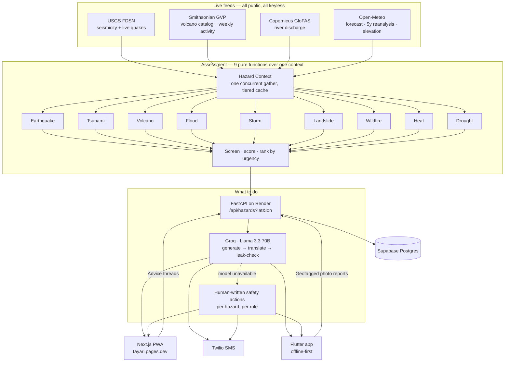

<div align="center">
  <h1>🌊 Tayari</h1>
  <p><b>AI Multi-Hazard Early Warning & Early Action System</b></p>
  <p><i>Flood · Earthquake · Tsunami · Volcano · Storm · Heat · Wildfire · Drought · Landslide</i></p>
  <p>
    <a href="https://tayari.pages.dev"><b>🌐 Use it now — free at tayari.pages.dev</b></a>
    ·
    <a href="https://github.com/Raul909/Tayari/releases"><b>📱 Download the Android app</b></a>
  </p>
</div>

---

## 💛 The Cause

In November 2023, floods on the Shabelle River displaced **half a million people** around Beledweyne. In South Sudan, floods between 2020 and 2022 affected **over a million**. In April–May 2024, the Tana River burst its banks in Kenya. In almost every case, the forecast data existed — global models like GloFAS saw the water coming days in advance.

The data existed. The warning never arrived.

Highly technical meteorological data stays trapped in dashboards, in English, written for scientists. The family on the riverbank, the teacher deciding whether to close the school, the clinic worker moving medicine to higher ground — they never see it, or can't act on it.

**Tayari** (Swahili for *Ready*) exists to close that gap between **information generated** and **information acted upon**. It translates forecasts into plain-language, role-specific advisories in the languages people actually speak, and delivers them to the phones people actually carry.

That gap is not specific to floods, and it is not specific to one region. The same pattern — the data existed, the warning never arrived — describes the 2004 Indian Ocean tsunami, every heatwave that kills people indoors and alone, and every drought that becomes a famine while the rainfall figures sit in a bulletin. So Tayari now assesses **nine hazards anywhere on Earth**: give it a location and it answers what threatens you here, and what to do about it.

Tayari is **free to use** and open source, because an early warning should never be behind a paywall:

- 🌐 **Web dashboard:** [tayari.pages.dev](https://tayari.pages.dev) — no signup, no cost
- 📱 **Android app:** [GitHub Releases](https://github.com/Raul909/Tayari/releases) — offline-first, built for low-bandwidth areas

## ✨ What it does

- 🌍 **Assesses nine hazards at any coordinate on Earth** — flood, earthquake, tsunami, volcanic activity, cyclone & severe storm, extreme heat, wildfire weather, drought and landslide — from live public feeds, with no API keys anywhere in the chain.
- 🔮 **Predicts** river flooding 1–7 days ahead with a calibrated multi-factor model on Copernicus GloFAS discharge and rainfall forecasts.
- 🧭 **Screens out what cannot happen.** A landlocked town gets no tsunami card at all. Hiding the impossible is what keeps the possible legible.
- 🗣️ **Translates** technical data into role-specific advisories (farmers, pastoralists, teachers, county officers) in **English, Somali, Swahili, Amharic, Oromo, Arabic and more** — with human-written template fallbacks so warnings still go out when the AI is down.
- 📱 **Delivers** via Twilio SMS, a Next.js PWA dashboard, and an offline-first Flutter app.
- 📸 **Listens** — community members submit geotagged photo reports, and coordinators or neighbours reply with advice threads that everyone can see.
- 🔐 **Secure authentication** with a full password-reset flow.

### The two numbers on every hazard

Each hazard carries **susceptibility** (can this happen here at all?) and **score** (is it happening now?), deliberately kept apart.

Collapsing them was tempting and wrong. A coastal city's tsunami susceptibility is permanently high; rendering that as a permanently high *risk* is precisely the alarm fatigue that gets the one real warning ignored. So an exposed-but-quiet place reads *"Exposed area, quiet right now"* — and only rises when something actually happens.

### Hazards, and where the numbers come from

| Hazard | Warning time | Source |
|---|---|---|
| **River flooding** | 1–7 days | Copernicus GloFAS v4 discharge · Open-Meteo rainfall |
| **Earthquake** | *None — no forecast is possible* | USGS FDSN event catalog |
| **Tsunami** | Minutes after a rupture | USGS FDSN · Copernicus DEM coastal geometry |
| **Volcanic activity** | Hours to weeks | Smithsonian GVP catalog · Smithsonian/USGS Weekly Activity Report |
| **Cyclone & severe storm** | 1–5 days | Open-Meteo wind, gusts, rainfall |
| **Extreme heat** | 2–7 days | Open-Meteo forecast vs. 5-year local climatology |
| **Wildfire weather** | 1–5 days | Chandler Burning Index · antecedent dryness |
| **Drought** | Weeks to months | Open-Meteo 90-day rainfall percentile |
| **Landslide** | Hours | DEM terrain relief · antecedent and forecast rain |

Two honesty constraints run through all of it. **Earthquakes are never presented as forecastable** — that card carries a readiness floor capped below HIGH and rises only in response to ruptures that have already happened. And **thresholds are local, never absolute**: 38 °C is an ordinary afternoon in Khartoum and a mass-casualty event in Glasgow, so heat, drought and fire are all scored against each location's own five-year climatology.

---

## 🏗️ Architecture Under the Hood

Tayari is built on a decoupled, service-oriented architecture:


```mermaid
graph TD
    subgraph Feeds["Live feeds — all public, all keyless"]
        F1[USGS FDSN<br/>seismicity + live quakes]
        F2[Smithsonian GVP<br/>volcano catalog + weekly activity]
        F3[Copernicus GloFAS<br/>river discharge]
        F4[Open-Meteo<br/>forecast · 5y reanalysis · elevation]
    end

    F1 & F2 & F3 & F4 --> CTX[Hazard Context<br/>one concurrent gather, tiered cache]

    subgraph Engine["Assessment — 9 pure functions over one context"]
        CTX --> A1[Earthquake] & A2[Tsunami] & A3[Volcano]
        CTX --> A4[Flood] & A5[Storm] & A6[Landslide]
        CTX --> A7[Wildfire] & A8[Heat] & A9[Drought]
        A1 & A2 & A3 & A4 & A5 & A6 & A7 & A8 & A9 --> RANK[Screen · score · rank by urgency]
    end

    RANK --> API[FastAPI on Render<br/>/api/hazards?lat&lon]

    subgraph Advisory["What to do"]
        API --> LLM[Groq · Llama 3.3 70B<br/>generate → translate → leak-check]
        LLM -.->|model unavailable| TPL[Human-written safety actions<br/>per hazard, per role]
    end

    LLM & TPL --> WEB[Next.js PWA<br/>tayari.pages.dev]
    LLM & TPL --> SMS[Twilio SMS]
    LLM & TPL --> APP[Flutter app<br/>offline-first]

    APP -->|Geotagged photo reports| API
    WEB -->|Advice threads| API
    API --> DB[(Supabase Postgres)]
```

**Nine hazards cost seven upstream calls, not sixty-three.** Most of them are different questions asked of the same observations — the rainfall driving a flood also drives a landslide and, by its absence, a drought — so the context is gathered once, concurrently, and every assessor reads from it. Caching is tiered by how fast each truth moves: seismic history for a day, live earthquakes for three minutes.

**One dead feed costs one card, never the page.** Assessors are pure functions that return `None` when a hazard is not physically relevant, and a failing feed degrades its own hazards in isolation.

**No bundled geodata.** Coastal distance and slope come from sampling a digital elevation model at 37 points around the location in a single request — a sample at or below sea level is ocean. A coastline shapefile would have been hundreds of megabytes on a 512 MB container.

Community reports, their advice threads, and sent-alert history are persisted to **Supabase (managed Postgres)** through the backend. Both the web dashboard and the mobile app write and read through the same API, so a report filed from a phone in the field shows up on a coordinator's dashboard — and vice versa — backed by one shared database. Supabase also handles user authentication (sign-up, login, and password reset). Locally the database falls back to SQLite so you can run everything with zero setup.

A small **Cloudflare Worker** does double duty: it proxies Open-Meteo requests (avoiding upstream rate limits) and pings the Render backend on a cron schedule so free-tier cold starts never delay a warning.

## 📍 Calibrated Flood Basins

Tayari assesses hazards **anywhere on Earth**, but its flood thresholds outside these eight basins are derived from each river's own five-year record — bankfull estimated as the median annual peak. Serviceable, and weaker than calibration.

These eight are calibrated properly: thresholds tuned against documented historical floods and scored by true skill statistic. They live at `/basins` and are the better answer where they apply.

| Basin | River | Country | Gauge (Town) | Historical Context |
|-------|-------|---------|--------------|--------------------|
| **Shabelle** | Shabelle River | Somalia | 4.74°N, 45.20°E *(Beledweyne)* | Nov 2023 — 500K displaced |
| **Juba** | Juba River | Somalia | 3.80°N, 42.54°E *(Luuq)* | Deyr/Gu seasonal floods |
| **Tana** | Tana River | Kenya | 2.27°S, 40.12°E *(Garsen)* | Apr–May 2024 |
| **Nzoia** | Nzoia River | Kenya | 0.10°N, 34.05°E *(Budalangi)* | Near-annual Lake Victoria basin floods |
| **Awash** | Awash River | Ethiopia | 11.73°N, 41.08°E *(Dubti)* | Afar floods 2020, 2023, 2024 |
| **White Nile** | White Nile | South Sudan | 6.21°N, 31.56°E *(Bor)* | 2020–2022 — 1M+ affected |
| **Blue Nile** | Blue Nile | Sudan | 15.55°N, 32.53°E *(Khartoum)* | Record 2020 floods — ~875K affected |
| **Omo** | Omo River | Ethiopia | 4.80°N, 35.96°E *(Omorate)* | South Omo floods 2019, 2023 |

*Adding a basin is a pure data change (`backend/app/data/basins.json`) — gauge/upstream points, discharge thresholds, impact figures and local infrastructure — so the coverage grid extends to new rivers without touching the model or UI.*

*Adding a **hazard** is one module in `backend/app/hazards/assessors/` exposing `assess(ctx) -> HazardRisk | None`, plus an entry in the registry and a set of safety actions. The context, caching, ranking, advisory generation and UI are all hazard-agnostic.*

---

## 🚀 Getting Started

The easiest way to try Tayari is the live dashboard at **[tayari.pages.dev](https://tayari.pages.dev)** — it's free and requires no setup.

If you want to spin it up locally, you'll need a couple of API keys. Don't worry — Open-Meteo is completely free and requires no auth!

### Prerequisites
- **Groq API Key**: Used to generate the AI advisories (free at [console.groq.com](https://console.groq.com)). Without one, Tayari falls back to built-in advisory templates.
- **Twilio credentials** *(optional)*: Account SID, Auth Token, and a From number for real SMS delivery. Without them, sends are simulated so the flow still works end-to-end; on a Twilio trial account you can only text numbers you've verified.
- **Supabase project** *(optional, for accounts + durable storage)*: `DATABASE_URL` (Postgres connection string) and `SUPABASE_JWT_SECRET`. Without them the backend uses local SQLite and runs in guest mode.

### Running the Backend (FastAPI)
```bash
cd backend
python -m venv venv
source venv/bin/activate
pip install -r requirements.txt

# Set up your .env file
cp .env.example .env
# Edit .env with your API keys

uvicorn app.main:app --reload --port 8000
```
*Note: The backend includes basic security headers and rate-limiting (`slowapi`) out of the box to mitigate XSS and brute-force attacks.*

### Running the Frontend (Next.js)
```bash
cd frontend
npm install
npm run dev
```
Head over to `http://localhost:3000` and you should see the MapLibre dashboard lighting up with live basin data!

### Running the Mobile App (Flutter)
The native mobile app is optimized for low-bandwidth environments, featuring offline maps, aggressive photo compression, and local caching of multilingual advisories. Prefer not to build it yourself? Grab the APK from [GitHub Releases](https://github.com/Raul909/Tayari/releases).
```bash
cd tayari_mobile
flutter pub get
flutter run
```
*Note: Photos are captured through the system camera app (no camera permission needed); the app asks for GPS permission to geotag community flood reports. Reports made while offline will be queued and synced automatically once a connection is restored.*

---

## 🛠️ Tech Stack

I chose tools that are fast, reliable, and perfectly suited for a machine-learning-driven web app:

- **Backend:** FastAPI (Python) — *Blazing fast, async-first, and natively speaks ML.*
- **Frontend (Web):** Next.js 16 (App Router, static export) & vanilla CSS — *PWA-ready, statically exported to Cloudflare's edge, on a calm paper-toned design system.*
- **Frontend (Mobile):** Flutter & Riverpod — *Native ARM performance, rendering vector maps instantly.*
- **Databases:** Supabase (managed Postgres) for the shared backend store & auth, and Isar — *ultra-fast offline-first NoSQL caching for the mobile app.*
- **Hazard engine:** Pure-Python scoring over live feeds — *a calibrated multi-factor flood model, USGS seismicity statistics, Chandler Burning Index, rainfall percentiles against local climatology. Transparent, explainable, no model artifact to ship, and every number traceable to a public source.*
- **Maps & Viz:** MapLibre GL JS, flutter_maplibre_gl & fl_chart — *Beautiful, interactive, and open-source.*
- **Data feeds:** USGS FDSN, Smithsonian Global Volcanism Program, Copernicus GloFAS & DEM, Open-Meteo — *all public, all keyless, no vendor lock-in on the thing that matters most.*
- **AI & Comms:** Groq API (Llama 3.3 70B) & Twilio — *Multilingual generation with a translation-quality guard, and reliable SMS delivery.*
- **Hosting:** Cloudflare Pages (web, free at [tayari.pages.dev](https://tayari.pages.dev)), Render (API), and a Cloudflare Worker for proxying + keep-alive.

---

## 🎯 Try it

**The hindcast.** Query the historical data for the Shabelle basin around October–November 2023 and watch the model predict the devastating Beledweyne floods days before they happened.

**The multi-hazard view.** A few locations that show what the engine actually distinguishes:

| Search for | What you should see |
|---|---|
| **Yogyakarta, Indonesia** | Volcanic activity leading, because Merapi is 30 km away and in the current Smithsonian/USGS weekly report |
| **Kathmandu, Nepal** | Earthquake at MODERATE — the readiness floor, with 314 M4.5+ events within 250 km since 1970 and an M8 in 1934. Never a prediction. |
| **Phoenix, Arizona** | Wildfire weather and drought together; heat sits LOW because 44 °C is normal there in August |
| **Chennai, India** | A tsunami card on an aseismic coast — because the source that matters is 1,500 km away, which is exactly what happened in 2004 |
| **Reykjavík, Iceland** | No tsunami card. Coastal and low, but the Mid-Atlantic Ridge does not produce the great ruptures that make far-field waves. |

---

## 🗺️ Roadmap — making lives easier, one feature at a time

Ideas we're actively thinking about, roughly in order of how many people they'd help:

| Feature | Why it matters |
|---------|----------------|
| **Two-way SMS & USSD** | Most at-risk households have basic phones, not smartphones. Subscribing to alerts and reporting conditions by texting a shortcode would reach the last mile. |
| **Voice advisories (IVR)** | Text excludes people who can't read. A phone call that reads the advisory aloud in Somali or Oromo serves elders and non-literate residents. |
| **Push notifications** | Free, instant risk-level-change alerts for the mobile app's home basin — no SMS costs for anyone. |
| **Safe-route guidance** | Don't just say "go to high ground" — show the route to the nearest assembly point, updated by community reports of closed roads and bridges. |
| **Satellite verification** | Cross-check community reports and forecasts against Sentinel-1 radar flood extent, so coordinators can separate rumor from reality. |
| **Anticipatory cash triggers** | Link HIGH-risk forecasts to humanitarian cash-transfer programs, so families can act *before* the water arrives, not after. |
| **Household registry** | Let community leaders register vulnerable households (elderly, disabled, pregnant) per basin so evacuations start with those who need the most time. |
| **Satellite fire detection** | NASA FIRMS thermal hot-spots would turn the wildfire card from fire *weather* into fire *detection* — it needs an API key, which is the only reason it is not in yet. |
| **Named cyclone tracking** | The storm card scores forecast wind and rain, not storm tracks. A free global track feed would add landfall timing. |
| **Low-cost river gauges** | Solar LoRa water-level sensors at bridges would give ground truth between GloFAS grid points and sharpen the model. |
| **Printable sitreps** | One-click PDF situation reports for county officers to brief governors and share with responders who work offline. |

Have an idea that would help your community? [Open an issue](https://github.com/Raul909/Tayari/issues) — Tayari is built in the open.
