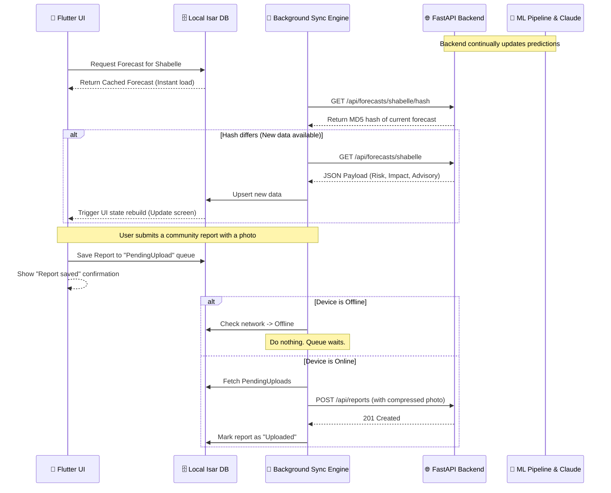

# Mobile App Data Flow Architecture

The Tayari Flutter app is designed around a strict **Offline-First Data Flow**. It acts as a lightweight consumer of the FastAPI backend, caching heavily to ensure continuous operation in zero-connectivity environments.

## End-to-End Data Flow

## Core Data Mechanisms

### 1. The Local Source of Truth (Isar Database)
Instead of the UI making HTTP requests directly to the API, the UI *only* listens to the local Isar database. 
- A Flutter `StreamBuilder` or Riverpod provider listens to the Isar collections.
- The Background Sync Engine is the only component allowed to make HTTP requests.
- When the Sync Engine updates Isar, the UI automatically reacts and repaints.

### 2. Delta & Hash Syncing
To save precious mobile data, the app does not download the full forecast JSON every time it opens.
- It hits a lightweight `GET /api/forecasts/{basin_id}/hash` endpoint returning just a string.
- If the hash matches the locally cached version, the app terminates the network request, saving data and battery.

### 3. Map Tile Caching (MapLibre Native)
- The app uses `flutter_maplibre_gl`.
- On first launch for a specific basin, the app downloads a localized vector tile package (`.mbtiles`) for a 50km radius around the basin coordinates.
- These tiles are saved to the device's persistent storage, meaning the map will render instantly even in airplane mode.

### 4. Push Notification Data Flow
- When the backend detects a severe risk level change (e.g., MODERATE -> HIGH), it triggers a silent push notification via FCM.
- The phone's OS wakes up the Flutter app in the background.
- The app runs the Sync Engine, fetching the high-risk advisory into the Isar database *before* alerting the user.
- Finally, a local notification is fired: "High Flood Risk: Tap to view advisory". When the user taps, the data is already on the device, ensuring instant access.
